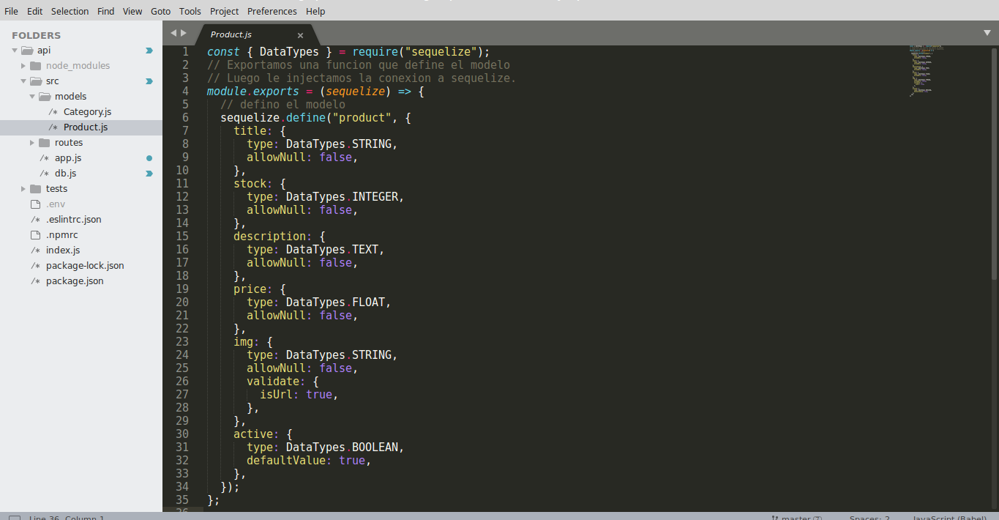
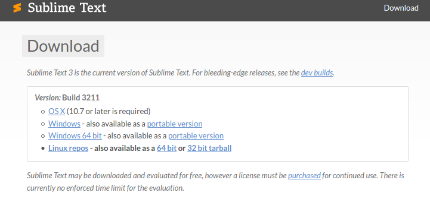
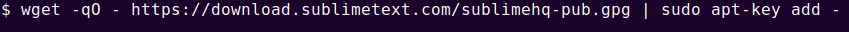
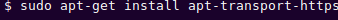
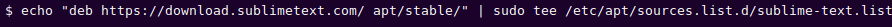
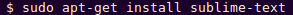
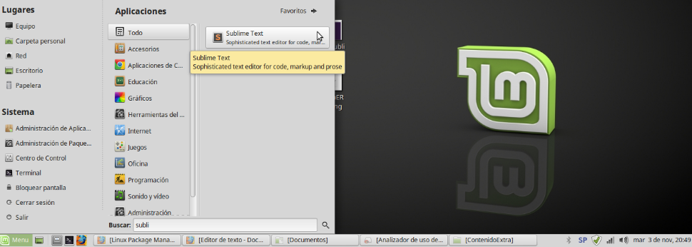
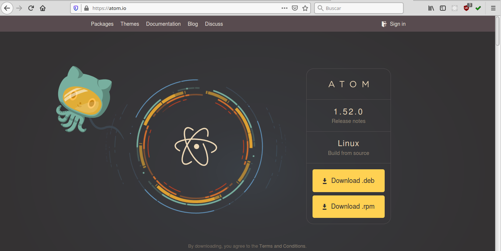
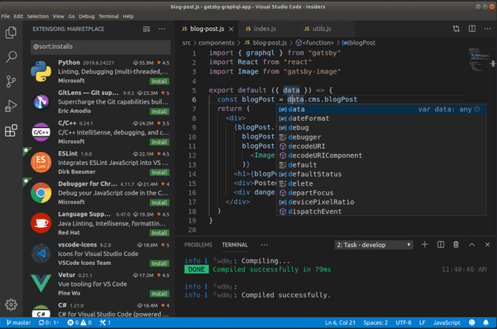
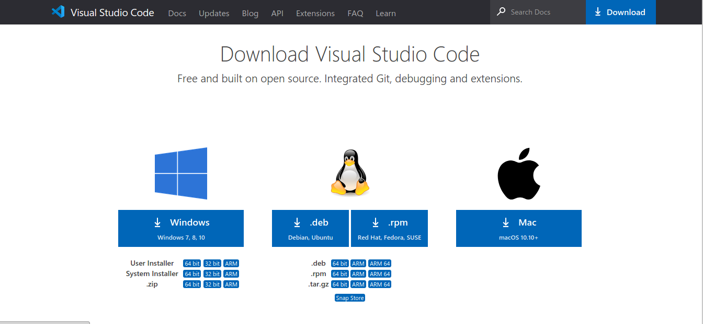

# Editor de Texto.

Para poder escribir código que pueda ser interpretado por un lenguaje de programación, necesitamos utilizar un editor de texto.
Hay varios. Puedes probarlos y elegir con el que te sientas más a gusto.

A continuación van a ver una lista de algunos editores de textos populares:

# [Sublime Text](https://www.sublimetext.com)

Es un editor de texto liviano, que cuenta con una serie de plugins para adaptarlo a las necesidades de cada desarrollador.

Es multiplataforma, por lo que se puede instalar tanto en Windows, como Linux y OS X.

Para instalarlo, realizaremos los siguientes pasos:

## En Windows o en OS X:

Nos dirigimos a la página oficial de Sublime Text.

<https://www.sublimetext.com>

Al ingresar, detectará automáticamente el sistema operativo que tenemos, y nos sugerirá descargar el instalador apropiado.

Presionamos el botón Download

Elegimos la opción adecuada según nuestro sistema operativo e iniciamos la descarga.

Finalizada la descarga, ejecutamos el instalador, seleccionamos las opciones siguiente, siguiente, etc, hasta completar el proceso.

## En Linux, en la distribución Ubuntu y derivados: 

Nos dirigimos al sitio oficial de Sublime Text. 
Aquí encontrarás las instrucciones para instalarlo https://www.sublimetext.com/docs/3/linux_repositories.html. 

En la terminal, ejecutamos el siguiente comando, para instalar la clave GPG:

Para asegurarte de que apt esté configurado para trabajar con orígenes https, ejecutamos:

Para agregar el repositorio estable, ejecutamos:

Finalmente, procedemos a instalar el programa:

Ahora, si en el Menú de inicio buscamos Sublime text, veremos la siguiente imagen:

# [Atom](https://atom.io/)

Es un editor de código abierto, disponible tanto para Windows, como Linux y para OS X.

Tiene integrada una consola de Git y Github, para llevar un control de versiones de tus proyectos.
Para comenzar el proceso de instalación, realizamos los siguientes pasos:

En Windows, Linux o en OS X, nos dirigimos al sitio oficial, mediante el siguiente enlace:

<https://atom.io/>

Al ingresar, el navegador detecta automáticamente el instalador que necesitamos bajar, según nuestro sistema operativo.

Allí,  presionamos el botón Download para almacenarlo en nuestra computadora.

## En Windows:

Una vez finalizada la descarga, hacemos doble click en el instalador y esperamos a que finalice el proceso de instalación.

## En Ubuntu y derivados:

Descomprimimos el instalador, hacemos doble click, y nos dirigimos a:

/usr/bin/atom

al hacer doble click, se abrirá el editor.

# [Visual Studio Code](https://code.visualstudio.com/)

Es un editor desarrollado por Microsoft.
Tiene integrada el control de versiones mediante Git y Github para tener un seguimiento de tus proyectos. Brinda una cantidad de extensiones que facilitan el trabajo de un desarrollador.

Para descargarlo, nos dirigimos al sitio oficial, en la sección Dowload y descargamos el instalador según nuestro Sistema Operativo:

<https://code.visualstudio.com/download>

|-|
|  |
|-|

Una vez finalizada la descarga, procedemos a ejecutar el instalador.

