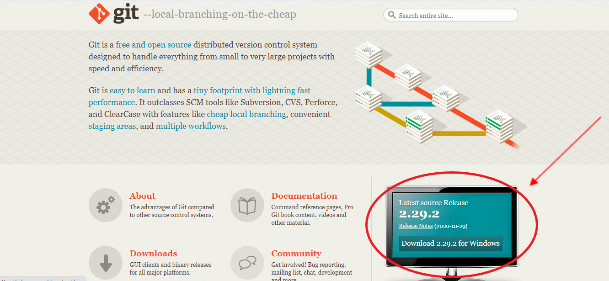
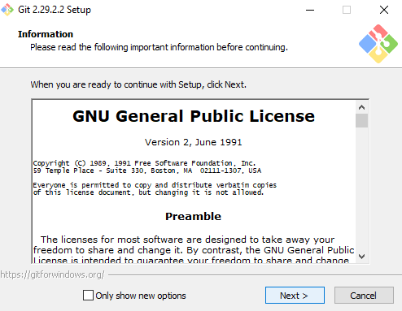
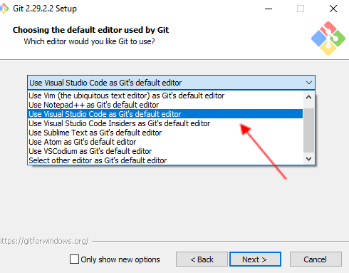
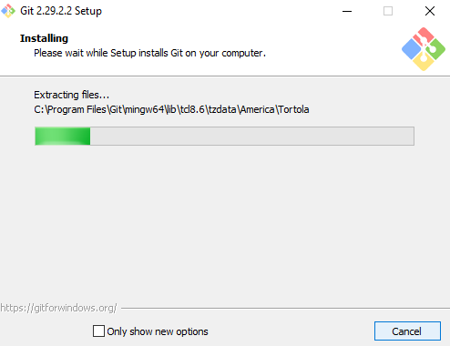
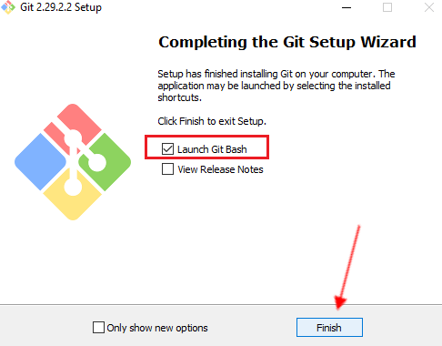
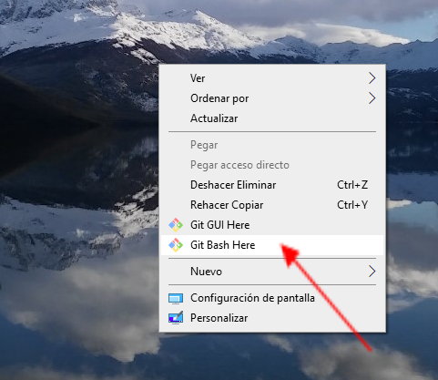
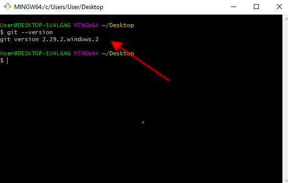

## ¿Qué es Git?
Git es un sistema de control de versiones, distribuido y open source. Un control de versiones es un sistema que registra los cambios realizados en un archivo o conjunto de archivos a lo largo del tiempo, de modo que puedas recuperar versiones específicas más adelante.

## Instalación
### Para Mac y Linux:
### Ver estos enlaces:
https://git-scm.com/book/es/v2/Inicio---Sobre-el-Control-de-Versiones-Instalaci%C3%B3n-de-Git  
https://www.youtube.com/watch?v=PSULlxUk744  
https://www.youtube.com/watch?v=oV0spTF71AI

### Para Windows:
Ingreso a <https://git-scm.com> y descargo la útlima versión.

 

 

 Una vez descargado, se abre el archivo .exe y van a visualizar la siguiente ventana 
 

 

 Clickeamos “Next” hasta que llegamos a esta parte: 
 

 

 En este momento de la instalación si quieren pueden elegir el editor de texto que van a usar. (Importante, ténganlo instalado antes de instalar Git) 
 

 Seguimos clickeando “Next” y luego “Install” 
 

 

 Por último, finalizar! Si seleccionan la opción "Launch Git Bash", una vez que finalizan la instalación se va a abrir la consola 
 

 

 Otra forma de abrir la consola es haciendo click derecho sobre el escritorio y elegir la opción "Git Bash Here" 
 

 

 Una vez instalado Git van a poder visualizar la consola: ingresamos el comando <code> git --version </code> para chequear que está instalado. Si ven la consola así, ya están listos para comenzar a trabajar! 
 

