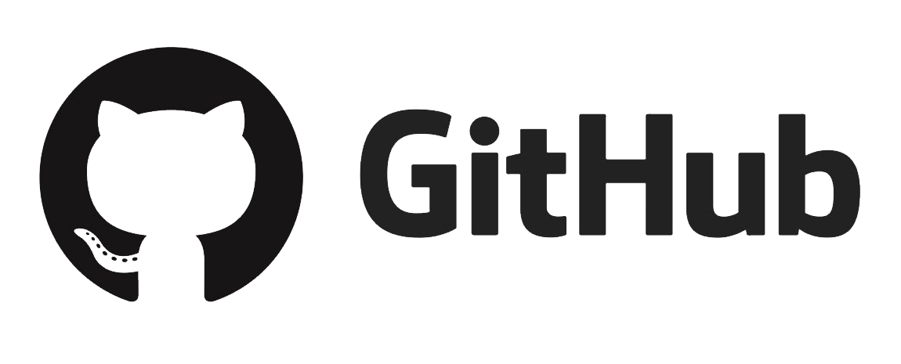
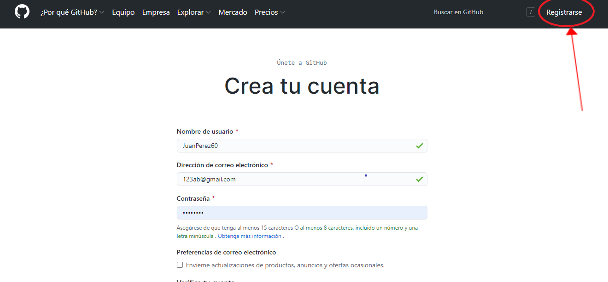
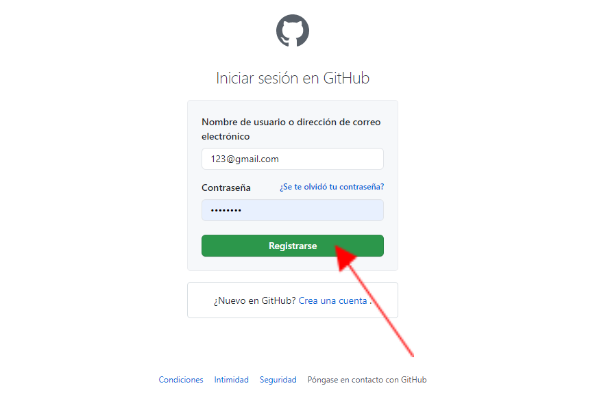
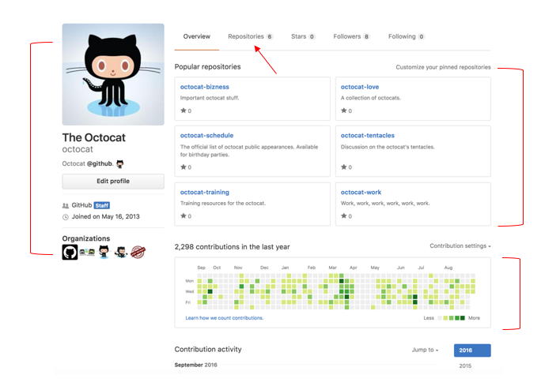
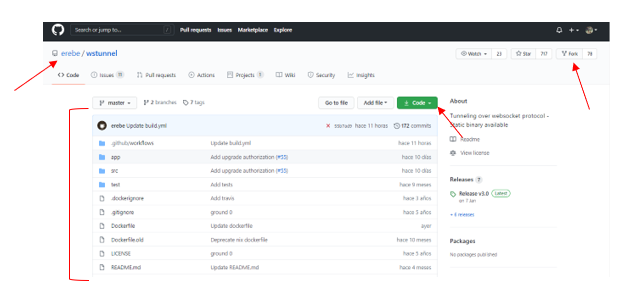

## ¿Qué es GitHub?

Es una red para almacenar tus repositorios, sería un repositorio de repositorios. Es uno de los tantos disponibles en internet, y el más popular. GitHub **NO** es lo mismo que Git, aunque funcionen muy bien juntos. Github es un lugar donde podés compartir tu código o encontrar otros proyectos. También actúa como portfolio para cualquier código en el que hayas trabajado.

## Comenzando

Para comenzar debes crearte una cuenta --- > https://github.com/ 🚀

 

 

 Una vez registrados, ingresan con su usuario y contraseña 
 

 

 Una vez que ingresan van a ver una página de inicio como la siguiente: 
 

 

A la izquierda tienen un acceso rápido a **sus repositorios**. En el centro van a ver la actividad de los usuarios que ustedes siguen.
Arriba a la derecha, si están logeados van a ver su fotito de perfil. Desde ahí tienen opciones para gestionar su perfil, repositorios y configuración. Si acceden a su perfil van a ver algo parecido a esto:

 

 Pueden poner una foto de perfil, editar su nombre, agregar su ubicación, link y organizaciones a las que pertenezcan. En el centro pueden fijar repositorios que ustedes quieran mostrar para que estén visibles en su perfil. Y más abajo se muestra un diagrama de todas las contribuciones que van haciendo en los repositorios. Si acceden a la pestaña de arriba que dice repositorios van a poder ver una lista de todos ellos. Cuando eligen un repositorio para ver, los lleva a una página como esta: 
 

 

 Así se ve un repositorio. Arriba a la izquierda tienen su nombre de usuario/nombre del repo.  En el centro pueden ver todos los archivos que tiene dentro el repo. El botón verde que dice “Code” es importante, si clickean ahí van a poder obtener la url del repo que van a usar para clonarlo (esto lo van a ver más adelante). Arriba a la derecha tienen tres botones. El primero de ellos Watch nos permite seguir un repositorio y con Star podemos marcar como favorito un repo que nos guste. Por último hay un botón que dice Fork, este es MUY importante! Lo van a necesitar cuando cursen el Prep y cuando hagan el Challenge!! Ya van a ver esto, por ahora ténganlo en mente. 
 

Acá termina nuestro breve recorrido por GitHub! Éxitos! 🍀
