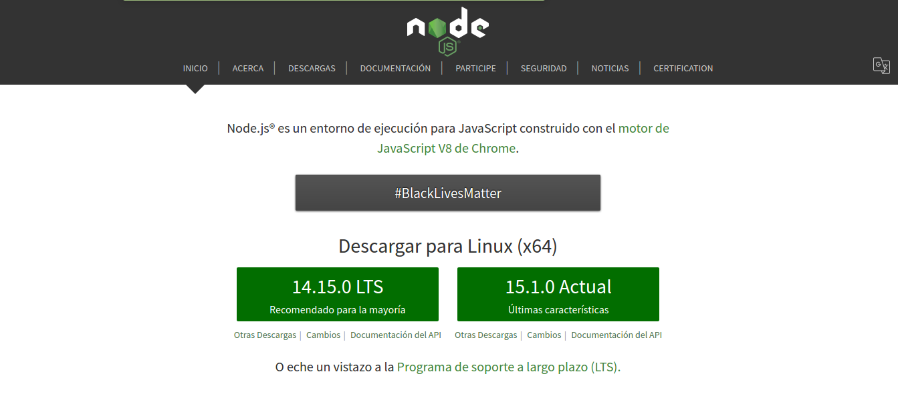
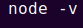
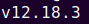

# Instalar Node js.

Para instalar Node js en nuestra computadora, nos dirigimos al sitio oficial:

<https://nodejs.org/es/>

Al ingresar, el sitio detectará nuestro Sistema Operativo y nos sugerirá que descarguemos el instalador adecuado.

|-|
|  |
|-|

Para proceder a la descarga, seleccionamos la versión LTS, que es la versión estable.
Una vez finalizada la descarga, procedemos a ejecutar el instalador.

Para corroborar que Node js se instaló correctamente, procedemos a ejecutar el siguiente comando por la consola o terminal de nuestro sistema operativo:

Y si seguimos los pasos anteriores, la consola o terminal, nos devolverá la versión de Node js que tenemos instalada:

