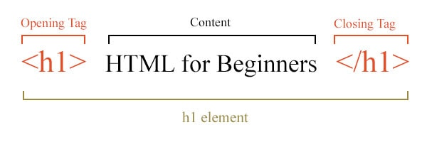

<p align='left'>
    
</p>
<table width="100%" style='table-layout:fixed;'>
  <tr>
    <td>
      <a href="https://airtable.com/shrSzEYT4idEFGB8d?prefill_clase=08-HTML">
        
        <br>
        Hacé click acá para dejar tu feedback sobre esta clase.
      </a>
    </td>
  </tr>
</table>

# Lección 8: Fundamentos HTML/CSS

En esta clase veremos:

* Introducción a HTML.
* Elementos/tags HTML básicos.
* Introducción a CSS.
* Selectores CSS y el tag \<style\> .
* Estilos Básicos.
* Modelo de Caja.
* Hojas de estilos externas y el tag \<link\>.

## Introducción HTML

HTML es el bloque básico con el que está construido internet. Todas las páginas web utilizan HTML. *No es un lenguaje de programación* propiamente dicho, sino, es un lenguaje de [**Markup**](https://es.wikipedia.org/wiki/Lenguaje_de_marcado): son lenguajes que incorporan al texto marcas o etiquetas que luego son interpretadas para darle información extra sobre la estructura del texto. En el caso de HTML, este será interpretado por los browsers, que tambien presentaran el código en forma gráfica.

HTML es la abreviatura de **Hyper Text Markup Language**:

  - Hyper Text: "Hyper Texto" quiere decir [texto con links](https://es.wikipedia.org/wiki/Hipertexto)
  - Markup Language: Los "Lenguajes de Marcado" son lenguajes de programación basados en etiquetas que uno agrega a un texto para darle estructura e información adicional. A diferencia de los "Lenguajes de Scripting" que se usan para crear programas informáticos, los lenguajes de marcado son sólo reglas para ordenar un documento.

## Elementos básicos HTML

HTML define una serie de elementos (o etiquetas, o tags) que serviran para delimitar texto. Cada tag está encerrado en `< >` y tiene un nombre. Los tags se abren y se cierran, los tags de cerrado incluyen con un "/" en el principio del tag que cierra. Por ejemplo:

```html
  <element>
    ...
  </element>
```




Algunos tags html, por su naturaleza, no necesitan tener nada *adentro*. Por lo tanto podemos abreviar su escritura y en vez de abrir y cerrar el tag, simplemente agregamos un "/" antes del bracket final.

```html
  
```

### Atributos

En su mayoría de los atributos de un elemento son pares *nombre-valor*, separados por un signo de igual «=» y escritos en la etiqueta de comienzo de un elemento, después del nombre del elemento. El valor puede estar rodeado por comillas dobles o simples. Los atributos de los tags nos sirven para cambiar su comportamiento o *configurarlos*.

Por ejemplo, el tag `` sirve para mostrar una imagen. Este tag recibe el atributo `src` que indica la (URL)[https://es.wikipedia.org/wiki/Localizador_de_recursos_uniforme] de donde está la imagen que queremos mostrar.

```html
  
```

### \<html>

El tag `<html>` va a contener a todos los demás tags dentro suyo. Este tag básicamente sirve para avisarle al browser que el contenido debe ser interpretado como `html`.

### \<head>

Este tag sirve para contener tags que contengan información sobre el documento, pero es información que no queremos que se renderee. Comunmente contiene el *titulo* de la página y *links* a recursos externos que pueda usar la página (javascript o css).

### \<title>

Es el título de la página, se mostrará en el tab del browser o en la parte superior (pero no en la página).

### \<body>

En este tag estára encerrado todo lo que querramos que se vea en la pantalla.

Entonces, hasta ahora, un documento HTML se ve así:

```html
  <html>
    <head>
      <title>Es el título de nuestra página</title>
    </head>
    <body>
    </body>
  </html>
```
Como ven, para mayor fácilidad en la lectura y la estructuración del documento, el documento HTML se escribe [indentando (o usando sangría)](https://es.wikipedia.org/wiki/Indentaci%C3%B3n).

(Todos los tags que presentaremos más abajo van siempre adentro de un tag `<body>`)

### \<p>

Es el tag para los párrafos. Mostrará el texto contenido dentro en una nueva línea.

```html
  <p>Soy un párrafo</p>
```

### \<span>

El elemento span es un contenedor de texto genérico. No inserta una nueva linea, como lo hace el elemento p. Sirve básicamente para darle estilo al texto.

### \<div>

El elemento div es un *contenedor* genérico. Es usado principalmente para dar estilo, imaginen que es una caja (cuyo tamaño y color podes modificar *a piacere*), y que dentro podés poner otras cajas iguales.

### \<a>

El tag a (del inglés *anchor*), nos permite crear **links** a otros documentos y páginas. Este tag recibe el *atributo* `href` que indica a dónde apunta el link.

```html
  <a href="http://www.soyhenry.com">Esto es un link!</a>
```

### \<h1> ... \<h6>

Son los tags de encabezado o títulos, están pensandos del 1 al 6, para indicar la importancia del contenido y su jerarquía.

```html
  <h1>El título más importante!</h1>
  <h3>título medianamente importante.</h3>
  <h6>El título menos importante.</h6>
```

### \

Este tag nos permite mostrar imágenes en la pantalla. Necesita el atributo `src` que indica la *URL* de donde sacar la imagen a mostrar.

```html
  
```

### \<ul>

Este tag representa una lista desordenada (del inglés "unordered list"). Este tag está diseñado para contener otros tags de tipo item. También existe el tag `<ol>` que viene de "ordered list".

### \<li>

Son los tags que contienen los items de la lista ('list item').

```html
  <ul>
    <li>
      <span>Elemento uno</span>
    </li>
    <li>
      <p>Podemos anidar cualquier tipo de tag adentro</p>
    </li>
    <li>
      <span>tercer elemento</span>
    </li>
  </ul>
```

## CSS

Como vimos, HTML nos sirve para dar estructura al contenido. En las primeras épocas de internet las páginas eran así. De hecho, todavía esta online la [primera página web](http://info.cern.ch/hypertext/WWW/TheProject.html). Como ven es bastante aburrida.
Luego se introdujo el concepto de CSS (Cascading Style Sheets); una forma de poder agregar color y estilos en nuestras páginas!

## Reglas CSS

Básicamente una regla CSS está compuesta por un atributo o propiedad y un valor. Seǵun el atributo que usemos y el valor que le pongamos a ese atributo vamos a obtener resultados visuales distintos en nuestro html.

Por ejemplo:

```css
html {
  color: red; /* "Color" es la propiedad y "red" el valor */
  font-size: 12px; /* "font-size" es la propiedad y "12px" el valor */
}
```

En este ejemplo, vemos dos atributos: `color` y `font-size`, el primero permite modificar el color del texto, en este caso está seteado a `red`; el segundo indica el tamaño del texto, en este caso `12px`.
Es importante notar que distintos atributos pueden recibir distintos valores, generalmente los que indican un color reciben un color (`red, blue`, etc...), los que son medidas reciben una medida (`12px, 15px`, etc..), y hay otras propiedades que reciben valor especificos, por ejemplo: la propiedad `border` (que dibuja un borde alrededor de un elemento) recibe tres valores: el color del borde, el ancho de la linea y el tipo de linea (punteada, continua, etc..).

> Hay muchos atributos CSS disponibles, más de los que podemos recordar. Así que no se asusten, con el tiempo van a empezar a memorizar estas propiedades. Pueden ver una lista completa [acá](https://cssreference.io/).

## Formas de dar estilo

Antes de empezar a dar estilos, necesitamos una forma de decirle al browser qué vamos a darles reglas de estilo.
Hay varias formas de lograr esto (más adelante veremos en detalle como funcionan cada una):
  * usando el atributo style: esta es la forma primitiva más simple, básicamente le damos reglas a cada tag html.
  * usando el tag `<style/>`: Se utiliza este tag en el `<head>` del documento HTML, con esto logramos agrupar todas las reglas que luego queremos que se apliquen a los elementos HTML.
  * Usar el tag `<link/>`: Este método nos permite definir las reglas CSS en un documento separado e *importarlo* a nuestra página (la ventaja que tiene es que podemos importar el mismo CSS a varias páginas).

### Atributo style

Todos los *tags* HTML pueden recibir el atributo `style`. Este atributo indica las reglas CSS (que veremos más abajo), que se aplicaran **sólo** al elemento que las tiene.

` <h1 style="color:blue;">Esto es un título Azul</h1>`

Pros:
  * Fácil de escribir y leer.
  * Cómo se aplican a un sólo elemento no hay forma de confundirse y que se aplique la regla a un elemento no deseado.
Cons:
  * La regla aplica a un sólo elemento, si quisieramos que varios elementos tengan la misma regla, deberíamos copypastear!

### \<style/>

El tag *style*, que se escribe en el <head> del documento, nos permite escribir reglas que se aplicaran a uno o varios elementos html. Es importante notar que con esta forma, podremos darle estilo a muchos elementos de una sóla vez, pero sólo a elementos que estén en el mismo documento.

```html
  <html>
    <head>
      <style>
        /*<!-- acá van las reglas -->*/
      </style>
    </head>
    <body>
    </body>
  </html>
```

Pros:
  * Lugar central donde podemos escribir las reglas CSS del documento
  * Podemos compartir reglas entre varios elementos iguales
Cons:
  * No podemos compartir las reglas con *otro* documento HTML.
  * Hay que prestar atención a las reglas, y a qué elementos se aplican.


### <link/>

Con el tag `<link>` dentro del `<head>` del documento, vamos a poder *importar* un archivo css que contenga varias reglas CSS. Funciona similar al tag `<style/>` anterior. Pero ahora tenemos la ventaja que podemos *compartir* el mismo archivo css con varios documentos HTML.

```html

 <!DOCTYPE html>
<html>
<head>
  <link rel="stylesheet" href="styles.css">
</head>
<body>
</body>
</html>
```

Pros:
  * Lugar central donde podemos escribir las reglas CSS del documento
  * Podemos compartir reglas entre varios elementos iguales
  * Podemos compartir reglas entre varios documentos HTML
Cons:
  * Hay que prestar atención a las reglas, y a qué elementos se aplican.

### Selectores

Para poder aplicar reglas de estilo a los elementos html, necesitamos una forma de saber cómo seleccionar los elementos a los que deseamos aplicar las reglas, para esto sirven los *selectores CSS*.


Hay varios tipos de selectores, los más básicos son los de tipo, donde indicamos a qué clase de elemntos se van a aplicar las reglas, el ejemplo de arriba usa un selector de tipo. Está diciendo: *aplicarle a todos los elementos de tipo <p\/> la regla de texto color rojo*.

El selector de tipo se puede usar con cualquier tipo de tag: p, div, body, etc. Otra forma de usar selectors poniendole un *nombre* o *identificador* a cada elemento HTML. Para esto existe un `atributo` que pueden recibir todos los tags llamados: `id` y `class`.

```html
  <div id="divId"></div>
  <div class="divClass"></div>
```

**Ids**: son nombre que sólo pueden aparecer una sólo vez en el documento. Es super especifico y sirve para seleccionar UN solo elemento en particular.

**Clases**: podemos asignarle el nombre de una clase a un grupo de elementos html.

#### Selectores básicos

* **Selector de tipo**: Selecciona todos los elementos que coinciden con el nombre del elemento especificado.
    Sintaxis: eltname
    Ejemplo: input se aplicará a cualquier elemento `<input>`.
* **Selector de clase**:
    Selecciona todos los elementos que tienen el atributo de class especificado.
    Sintaxis: .classname
    Ejemplo: .index seleccionará cualquier elemento que tenga la clase "index".
* **Selector de ID**
    Selecciona un elemento basándose en el valor de su atributo id. Solo puede haber un elemento con un determinado ID dentro de un documento.
    Sintaxis: #idname
    Ejemplo: #toc se aplicará a cualquier elemento que tenga el ID "toc".
* **Selector universal**
    Selecciona todos los elementos. Opcionalmente, puede estar restringido a un espacio de nombre específico o a todos los espacios de nombres.
    Sintaxis: * ns|* *|*
    Ejemplo: * se aplicará a todos los elementos del documento.
* **Selector de atributo**
    Selecciona elementos basándose en el valor de un determinado atributo.
    Sintaxis: [attr] [attr=value] [attr~=value] [attr|=value] [attr^=value] [attr$=value] [attr*=value]
    Ejemplo: [autoplay] seleccionará todos los elementos que tengan el atributo "autoplay" establecido (a cualquier valor).

### Anatomía de las reglas de estilo

Ahora que sabemos como *seleccionar* los elementos a los que queremos aplicar las reglas podemos escribir qué reglas queremos que se apliquen. Para el ejemplo vamos a usar la etiqueta `<style\/>`.

```html
  <style>
    body {}

    .divClass {}

    #divId {}
  </style>
```

En el ejemplo de arriba vemos tres selectores. El primero es para el elemento `body`, el segundo para todos los elementos de la clase `divClass` y el tercero para el elemento que tenga el id: `divId`. Dentro de los `{}` vamos a escribir todas las reglas que queremos que se apliquen a esos elementos.

## Aplicando reglas

Ahora que tenemos los elementos seleccionados podemos empezar a agregar las reglas que habíamos visto antes.

```css
  div {
    propiedad: valor;
  }
```

## Introducción al modelo de caja (Box Model)

Para poder entender y luego manipular la forma en que los elementos HTML aparecen distribuidos en la página, tenemos que aprender cómo son representados estos en el browser.


En un documento html cada elemento es representado como una *caja rectangular* y en CSS cada una de estas cajas tiene 4 capas que podemos manipular. Yendo desde afuera hacia adentro, las capas son:

* **margin**: el espacio que separa al elemento de los otros elementos. Si los pensamos como cajas, es el espacio entre las cajas.

* **border**: el "borde de la caja". Podemos hacerlo visible con diferentes grosores, estilos y colores, como ya hicimos varias veces en ejercicios anteriores.

* **padding**: el espacio entre el borde de la caja y su contenido. En la metáfora de la caja, podríamos por ejemplo tener una caja grande con algo chiquito adentro, osea que "habría mucho padding".

* **content**: el contenido de la caja. Por ejemplo el texto en un h1, otros tags anidados, etc, todo lo que esté contenido en el elemento.

### height (alto) y width (ancho)

Podemos decirle al navegador exactamente qué tan *ancho* y *alto* queremos que sea nuestro elemento (contenido), esto se usa en divs, imgs y otros elementos basados en la altura (para determinar el tamaño del texto, necesitaremos usar un propiedad de estilo diferente). Los valores de tamaño pueden estar en muchas medidas diferentes, pero el más común es el píxel "px".

```css
  div {
    height: 400px;
    width: 400px;
  }
```
### margin

El margen es el área transparente alrededor del elemento que deseas que no choque con nada. Es la capa más externa en el Modelo de caja.

### border

Borde establecerá un *borde* alrededor de su elemento, puedes determinar el tamaño, color y estilo del borde. Puede encontrar una lista de estilos de borde aquí: https://developer.mozilla.org/en-US/docs/Web/CSS/border. El borde está fuera del padding, pero dentro del margen.

```css
  div {
    border: 1px solid black;
  }
```
### padding

El padding es el area transparente entre el borde y el contenido, es similar al margen, pero para adentro

### Cálculo del modelo de caja

Cuando establecemos el *alto* y el *ancho* de un elemento a traves de la regla css *height* y *width*, sólo estamos configurando el contenido. Para calcular la altura y el ancho reales, tenemos que tener en cuenta el padding, el borde y el margen.

* El padding es un área transparente alrededor del contenido.
* El borde se envolverá alrededor del relleno
* El margen es el área transparente más externa que envuelve toda la caja.

Por ejemplo. Si establecemos la altura del contenido en 20 px y el ancho en 20 px, el relleno en 5 px, el borde en 1 px y el margen en 10 px.

  Altura real = 25px (contenido) + 2 * 5px (relleno, cada lado) + 2 * 1 (borde de cada lado) + 2 * 10 (margen, cada lado) = 57px

  Ancho real = 25px (contenido) + 2 * 5px (relleno, cada lado) + 2 * 1 (borde de cada lado) + 2 * 10 (margen, cada lado) = 57px

Saber esto nos ayudará a dimensionar y posicionar nuestros elementos correctamente.

## Un par de otras propiedades CSS

### background

El background se puede establecer en una variedad de reglas, la más común sería establecer el fondo en un color o una imagen. Ambos se muestran a continuación.

```Css
  .divClass {
    background: red;
  }
  #divId {
    background: url ('http://imageurl.com/image.jpg');
  }
```

### color

El color se usa sólo para texto. Establecerá el color de tu texto

### font-size

No podemos usar ancho o alto para el texto, pero podemos determinar el tamaño de la fuente utilizada. Puede usar cualquier unidad de tamaño aquí que usaría con una fuente en un procesador de textos (px, em, in, etc.). El más popular es px.

## Hojas de estilo externas y el elemento \ <link>

Hemos explicado cómo usar el elemento html \ `<style>`. Esto está bien si tiene una página web muy pequeña y un estilo mínimo, pero la mayoría de las páginas comenzarían a sentirse abarrotadas muy rápidamente si incluimos todo nuestro CSS en el HTML. Afortunadamente, tenemos una solución para eso, hojas de estilo externas y el elemento \ `<link>`.

Una hoja de estilo externa es simplemente otro archivo con el tipo de archivo .css. Convencionalmente, este archivo se llama algo así como "style.css". Podemos tomar todas las reglas de estilo que escribimos entre las etiquetas \ `<style>` y transferirlas directamente al archivo css. No necesitamos incluir nada más, solo las reglas de estilo.

Una vez que tengamos una hoja de estilo externa creada, necesitaremos asegurarnos de que el navegador lea ese archivo y aplique las reglas a nuestra página. Le decimos al navegador que busque ese archivo utilizando el elemento \ `<link>`. Podemos eliminar las etiquetas \ `<style>` y en su lugar agregar el elemento \ `<link>`. Dentro del elemento de enlace, necesitaremos proporcionar la ubicación y el tipo de archivo que estamos vinculando. Utilizaremos dos banderas, la bandera "rel" y la bandera "href".

La bandera rel solo le dirá al navegador qué tipo de archivo es y cómo procesarlo. En nuestro caso lo configuraremos como "hoja de estilo"

La bandera href le dirá al navegador dónde encontrar el archivo. Si el archivo está en la misma carpeta que nuestro archivo html, podemos configurarlo en: "./styles.css" (esta ruta será relativa)

```HTML
  <link rel = "stylesheet" href = "./ styles.css" />
```

Ahora que tenemos nuestra hoja de estilo externa vinculada a nuestro archivo HTML, deberíamos ver las reglas de estilo que establecemos reflejadas en nuestra página.

## Recursos adicionales

* [MDN official CSS documentation](https://developer.mozilla.org/en-US/docs/Learn/CSS/Introduction_to_CSS/How_CSS_works)
* [MDN official HTML documentation](https://developer.mozilla.org/en-US/docs/Web/HTML)
* [Codecademy: Learn HTML](https://www.codecademy.com/learn/learn-html)
* [Codecademy: Learn CSS](https://www.codecademy.com/learn/learn-css)
* [w3schools: The Box Model](https://www.w3schools.com/css/css_boxmodel.asp)
