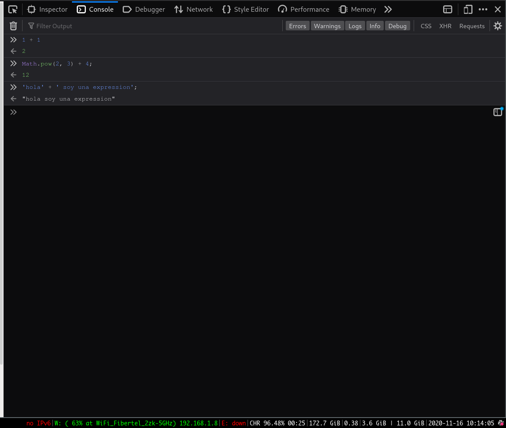
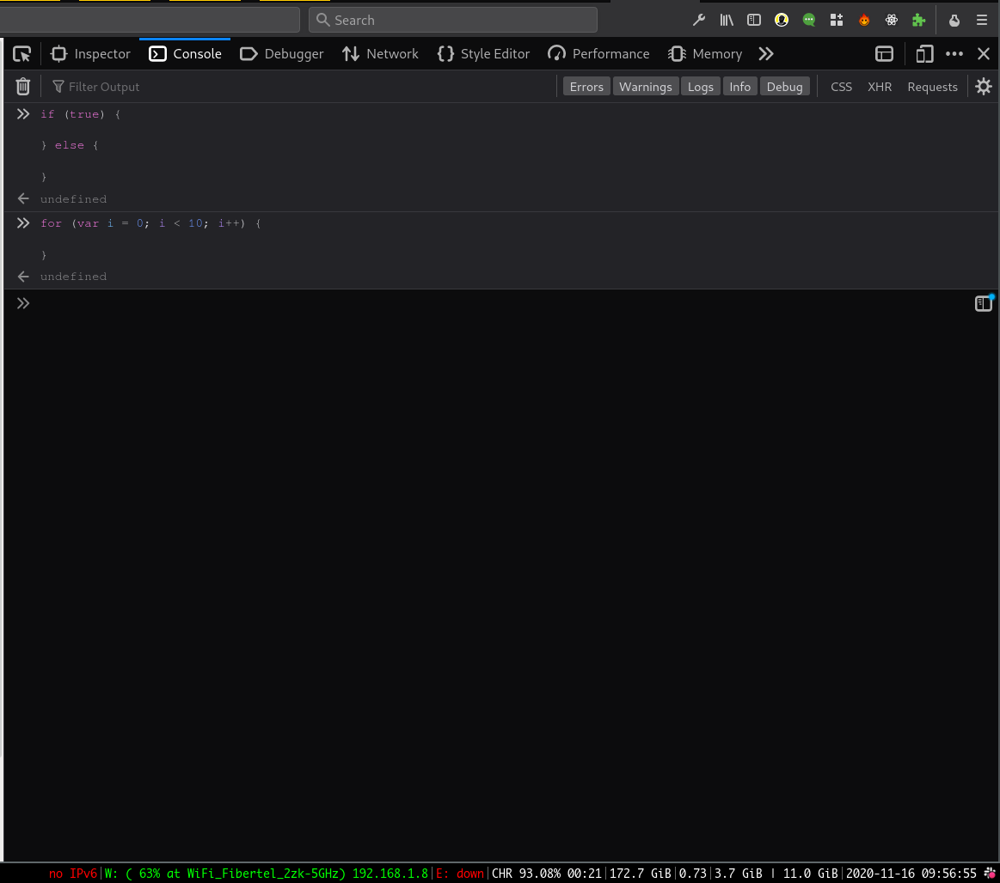

<table width="100%" style='table-layout:fixed;'>
  <tr>
    <td>
      <a href="https://airtable.com/shrSzEYT4idEFGB8d?prefill_clase=conceptos-Expressions-vs-Statements">
        
        <br>
        Hacé click acá para dejar tu feedback sobre esta clase.
      </a>
    </td>
  </tr>
</table>

# Expresiones vs Statements

<iframe src="https://player.vimeo.com/video/480856050" width="640" height="360" frameborder="0" allow="autoplay; fullscreen" allowfullscreen></iframe>


Podemos decir que todo el código que escribimos en JS o "hace algo" o "retorna algo" (o una combinación de los dos). En la terminología de lenguajes de programación esta diferencia está clasificada en la definición de **expressions** (expresiones) y **statements** (sentencias).

Podriamos definir conceptualmente a ambas como:
  - Una **expression** siempre se convierte (retorna) un valor.
  - Un **statement** realiza una acción.

Cuando escribimos código, todo el tiempo mezclamos expresiones y statements para conseguir el resultado final. Por lo tanto, al principio es un poco díficil ver la diferencia entre las dos, pero vamos a intentar ejemplificar lo anterior:

```js
// retorna algo
1 + 1
Math.pow(2, 3) + 4;
'hola' + ' soy una expression';
```

`1 + 1` intuitivamente se convierte o resuelve a `2`! eso es una expresión. Es cualquier cosa que escribamos y esperamos que se convierta en otro valor.
Cuando *pegamos* una expression en la consola de Firefox o de Chrome, vamos a poder ver el resultado al que resuelve:




```js
// hace algo
if (condicion) {
  // código ejecutado si es true
} else {
  // código ejecutado si es false
}
```

En este ejemplo, vemos que el `if` "hace algo", es decir, escribimos el if para que bifurque le ejecución del código según el valor de `condicion`. Como ya sabemos, si `condicion` tiene un valor *verdaderoso* entonces se ejecutará el bloque de código de arriba, y si no, el de abajo.
Fijensé que acá es importante discriminar lo que está *adentro* de los bloques de código, ya que ahí adentro podriamos escribir **expresiones** que sí devuelvan algo.

Nos podemos dar cuenta que algo es un statement, porque si lo *pegamos* en la consola del intérprete -por ejemplo, en la consola del Firefox o Chrome- vamos a ver que no produce ningún resultado:



> Una regla fácil para distinguir entre una *expression* y un *statement* en JS es la siguiente:
  Si podemos ponerlo dentro de un `console.log`, es una *expression*, si no, es un *statement*.
  Por ejemplo:
  ```js
    // expresiones!
    console.log(1 + 1);
    console.log(Math.pow(2,3) + 22);
    
    // statements
    console.log(if( true) {
      // código
    });
    // jamás haríamos esto de arriba, no?
  ```

> El **operador ternario**, es una expresión o un statement? ej: (numero > 10 ? 'mayor' : 'menor');


## Expressions

Cómo dijimos arriba, una *expression* es cualquier pedazo de código **que pueda ser evaluado a un valor**. Justamente por esto, las vamos a usar en lugares donde JavaScript *espera un valor*. Por ejemplo, cómo cuando pasamos una expresión como argumento de una función.

Según la documentación de MDN, las expresiones se pueden clasificar en las siguientes categorías:

### Expresiones Aritméticas

Son las expresiones que resuelven a un valor **númerico**. Por ejemplo:

```js
10;
1 + 10;
2 * 16;
```

### Expresiones de Strings

Son expresiones que resuelven a una **string**. Por ejemplo:

```js
'hola';
'hola' + ' como va?';
```

## Expresiones lógicas

Son expresiones que resuelven a un valor **booleano**. Por ejemplo:

```js
10 > 9;
11 === 2;
false;
```

## Expresiones primarias

Son expresiones que se escriben por si mismas, y no utilizan ningún operador. Incluyen a valores literales, uso de variables, y algunos keywords de JS. Por ejemplo:

```js
'hola';
23;
true;
this;  // hace referencia al keyword this
numero; // hace referencia a la variable numero
```

## Expresiones de asignación

Cuando utilizamos el operador `=` hablamos de un *assigment expression*. Está expresión retorna el valor asignado. Por ejemplo:

```js
a = 1; // si probamos esto en la consola, vemos que retorna el valor 1.
var c = (a = 2); // vamos a ver que dentro de la variable c, está el valor retornado por la expresion `a = 2`
```

> Este es un caso muy particular, nótese que esta expresion retornar una valor, **pero a su vez hace algo**!! Ese algo, es guardar el valor a la derecha del signo `=` en la variable a la izquierda del signo `=`.
  Otra cosa a notar, es que si usamos el keyword `var` la expresión retorna `undefined`, es decir, no es lo mismo una asignación que una declaración de variables.

## Expresiones con efectos secundarios (side effects)

Son expresiones que al ser evaluadas retornan algo, pero a su vez tienen *un efecto secundario* (incrementar un valor, etc...). Por ejemplo:

```js
contador++; // retorna el valor de contador e incrementa uno.
++contador; // incrementa el valor de contador y retorna el valor;

mult *= 2;// multiplica mult por dos, asigna ese valor a mult y retorna el valor;
```

## Statements (sentencias)

Los *Statements* son instrucciones que le damos al intérprete de JS para que **haga algo**, ese algo puede ser: crear una variable, ejecutar un bloque de código N veces, ejecutar un bloque de código o no según una condición de verdad, declarar una función, etc...

Podemos clasificar a los Statements en las siguientes categorías:

### Declaration Statements:

Este tipo de statements indican al intérprete que declare variables o funciones, se utiliza el keyword `function` y `var`. Por ejemplo:

```js
var prueba; // declaro la variable prueba
var toni;  // declaro la variable toni

function suma(a, b) {  // declaro la función suma;
  // bloque de código
}
```

> Habiamos dicho que por regla general lo que podamos pasarle a una función (por ejemplo, `console.log`) por argumento era una expresión... y muchas veces pasamos una declaración de una función por argumento. Esto sucede porque en JS existen tambien las **function expressions**.

#### Function expressions vs function declarations

Cuando declaramos una función el intérprete puede *interpretarla* como un statement o cómo una expresión, dependiendo del contexto. Por ejemplo:

```js
//function declaration

function resta(a, b) {
 // bloque de código
}

// function expression

var resta = function (a, b) {
  // bloque de código
}

array.map(function() {
  // código;
});
// el argumento de la función espera una expression


// Immediately Invoked Function Expression
(function () {
    console.log('IIFE');
})();
```

Cómo vemos en el ejemplo de arriba, el intérprete *hace algo*: declara la función. Por lo tanto es un statement. En cambio, en el segundo ejemplo, estamos haciendo una asignación, y la asignación espera una *expresión* en la parte de la derecha, asi que le estamos pasando un function expression.

> Nótese que un function expression puede no tener nombre. Estas son las llamadas **funciones anónimas**.

### Conditional Statements:

Estos statements sirven para controlar el flujo de ejecución de código según si se cumple o no una condición. Por ejemplo:

```js
if (condicion) { // condicion puede ser cualquier expression!!
  // ejecuta este bloque si condicion es true
} else if (condicion2) {
  // ejecuta este bloque de código si condicion no es true y condicion2 es true
} else {
  // ejecuta este bloque de código si condicion y condicion2 no son true.
}
```

### Loops (bucles) y Jumps (saltos)

Estos statements también controlan el flujo de ejecución del código, pero hacen que un bloque se ejecute N veces (ej: `for`), o que la ejecución salte a otro contexto (ej: `return`). Por ejemplo:

```js
// loops
while(condicion) { // condicion es una expresión!!
  // ejecuta este código mientras condicion sea true;
}

for (var i = 1; i < 10; i++) {
  // ejecuta este bloque de código 9 veces;
}

// jumps

function () {
  // bloque de código
  return;  // cuando llegue acá, sale de la ejecución de la función y retorna un valor;
  // bloque de código
}


for (var i = 1; i < 10; i++) {
  // ejecuta este bloque de código N veces;
  continue; // salta a la siguiente iteración del bucle;
  // desde acá no se ejecuta;
}

throw new Error('hubo un error, se termina la ejecución');
```

### Expression Statements

JS tiene la particularidad qué en donde sea que el intérprete espera un *statement*, nosotros podemos pasarle una *expresión*. Esto da lugar a los llamados *expression statements*.

> **Esto no funciona en sentido inverso, donde se espera una expresión *NO* podemos pasar una statement**.


