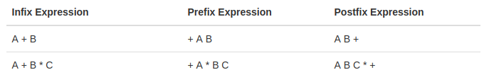

# Lección 2: Introducción a Javascript

En esta lección cubriremos:

* Introducción a Javascript
* Variables
* Strings, Numbers y Booleanos
* Math
* Introducción a las Funciones
* Control de flujo y operadores de comparación
* Introducción a Node y NPM

## Introducción a Javascript

Si imaginamos un sitio web como una casa, el HTML hace de materiales (madera, ladrillos y concreto), el CSS es cómo ponemos todos esos materiales juntos, y Javascript es la electricidad, las cañerías y el gas. Es lo que hace que la página "funcione". Javascript fue diseñado originalmente para ser usado únicamente en el front-end como forma de que los desarrolladores web puedan añadir funcionalidades a sus páginas web, y en sus comienzos era solo eso. Recientemente, la introducción del "_engine_ V8" de Google ha mejorado la velocidad y el funcionamiento de JS. Esto trajo novedades en el desarrollo creando frameworks de Javascript para el front-end, y eventualmente Node.js, que es una manera de correr Javascript en el servidor (back-end).

Este nuevo desarrollo ha llevado a un resurgimiento de Javascript. Javascript es uno de los lenguajes de programación más utilizados en el mundo. Ahora encontramos que Javascript se usa en front-end, back-end, desarrollo móvil, IoT, y realmente en cualquier lugar donde se usaría un lenguaje de programación tradicional. Recientemente, se lanzó la versión más reciente del lenguaje Javascript (ES6), nos enfocaremos y usaremos ES6 en este curso. Tenga en cuenta, Javascript! = Java. Aunque comparten nombres similares (desafortunadamente, esto fue considerado una característica por los primeros pioneros de Javascript), ahí es donde terminan las similitudes.

## Variables

En el corazón de Javascript se encuentran las variables. Una variable es una forma de almacenar el valor de algo para usar más tarde. (Una nota para aquellos con conocimientos previos de programación: Javascript es un lenguaje de tipado débil, una variable se puede configurar (y restablecer) a cualquier tipo, no necesitamos declarar su tipo al iniciar la variable).

La anatomía de una variable es primero la palabra clave, un espacio, el nombre que le estamos dando a la variable, un signo de "igual", el valor que le estamos asignando a la variable y luego el punto y coma.

Existen tres formas de declarar una variable:
```javascript
    var nombre = 'Juan';
    let apellido = 'Perez';
    const comidafavorita = 'Pizza';
```

### var

`var` es la forma declarar una variable en ES5. Esta es una _palabra clave_ genérica para "variable".

### let

`let` es una nueva palabra clave de ES6, esto asignará una variable muy similar a` var`, pero con un comportamiento un poco diferente. Lo más notable es que difiere al crear un "nivel de _scope_" (hablaremos sobre esto más adelante).

### const

`const` también es nuevo en ES6. Un `const` es una variable que no se podrá cambiar. Esto es la abreviatura de "constante".

### console.log

Otro concepto del que hablaremos de inmediato es

```javascript
console.log();
```

Este método muy simple nos permitirá imprimir en la consola todo lo que pongamos entre paréntesis.

## Strings, Numbers, and Booleans

Estos son los tipos de datos más básicos en Javascript.

### Strings

Las "strings" son bloques de texto, siempre se definirán entre comillas, ya sea simple o doble. Cualquier texto entre comillas es una cadena.

```javascript
const nombrePerro = 'firulais';
```
### Numbers

Los números son solo eso, números. Los números NO se envuelven en comillas. Pueden ser negativos también. Javascript tiene una limitación en el tamaño de un número (+/- 9007199254740991), pero muy raramente aparecerá esa limitación en nuestro uso diario.

```javascript
const positivo = 27;
const negativo = -40;
```

### Boolean

Los booleanos provienen de la informática de bajo nivel. Es un concepto que alimenta el código binario y el núcleo de las computadoras. Es posible que haya visto código binario en el pasado (0001 0110…), esto es lógica booleana. Esencialmente significa que tiene dos opciones, activar o desactivar, 0 o 1, verdadero o falso. En Javascript usamos booleanos para significar verdadero o falso. Esto puede parecer simple al principio, pero puede complicarse más adelante.

```javascript
const meEncantaJavascript = true;
```

## Operadores

Un operador no es otra cosa que una función, pero al ser funciones básicas para el Engine y que se utilizan muchos, se escriben de una forma particular y que en general es corta y simple. Generalmente, los operadores toman dos parámetros y retornan un resultado.
Por ejemplo: Para el intérprete al ver el signo `+`, sabe que tiene que ejecutar la función suma (que tiene internamente definida), y toma como parámetros los términos que estén a la izquierda y la derecha del operador. De hecho, es equivalente a tener una función que se llame `suma` y que reciba dos parámetros:

```javascript
var a = 2 + 3; // 5

function suma(a,b){
  return a + b;
  // usamos el mismo operador como ejemplo
  // Si no deberiamos hacer sumas binarias!
}
var a = suma(2,3) // 5
```

De hecho, esa forma de escribir tiene un nombre particular, se llama notación notación `infix` o `infija`, en ella se escribe el operador entre los operandos. Pero también existen otro tipos de notación como la `postfix` o `postfija` y la `prefix` o `prefija`. En estas última el operador va a la derecha de los operandos o a la izquierda respectivamente.



En fin, lo importante a tener en cuenta es que los operadores _son_ funciones.

## Precedencia de Operadores y Asociatividad

Esto parece aburrido, pero nos va a ayudar a saber cómo piensa el intérprete y bajo que reglas actua.

La _precedencia de operadores_ es básicamente el orden en que se van a llamar las funciones de los operadores. Estás funciones son llamadas en _orden de precedencia_ (las que tienen __mayor__ precedencia se ejecutan primero).  O sea que si tenemos más de un operador, el intérprete va a llamar al operador de mayor precendencia primero y después va a seguir con los demás.

La _Asociatividad de operadores_ es el orden en el que se ejecutan los operadores cuando tienen la misma precedencia, es decir, de izquierda a derecha o de derecha a izquierda.

> Podemos ver la documentación completa sobre Precedencia y Asociatividad de los operadores de JavaScript [acá](https://developer.mozilla.org/en/docs/Web/JavaScript/Reference/Operators/Operator_Precedence#Table)

Por ejemplo: `console.log( 3 + 4 * 5)` Para resolver esa expresión y saber qué resultado nos va a mostrar el intérprete deberíamos conocer en qué orden ejecuta las operaciones. Al ver la tabla del link de arriba, vemos que la multiplicación tiene una precedencia de 14, y la suma de 13. Por lo tanto el intérprete primero va a ejecutar la multiplicación y luego la suma con el resultado de lo anterior -> `console.log( 3 + 20 )` -> `console.log(23)`.

> Cuando invocamos una función en Javascript, los argumentos son evaluados primeros (se conoce como [__non-lazy__ evaluation]()), está definido en la [especificación](http://es5.github.io/#x11.2.3).
> No confundir el orden de ejecución con asociatividad y precedencia, [ver esta pregunta de StackOverflow](http://stackoverflow.com/questions/13849906/operator-precedence-and-associativity-with-math-floormath-random).

Ahora si tuvieramos la misma precedencia entraría en juego la asociatividad, veamos un ejemplo:

```javascript
var a = 1, b = 2, c = 3;

a = b = c;

console.log(a, b, c);
```

Qué veriamos en el console.log? Para eso tenemos que revisar la tabla por la asociatividad del operador de asignación `=`. Este tiene una precedencia de 3 y una asociatividad de `right-to-left`, es decir que las operaciones se realizan primero de derecha a izquierda. En este caso, primero se realiza `b = c` y luego `a = b` (en realidad al resultado de `b = c`, que retorna el valor que se está asignando). Por lo tanto al final de todo, todas las variable van a tener el valor `3`. Si la asociatividad hubiese al revés, todos las variables tendrían el valor `1`.

## Math

Los operadores matemáticos trabajan en JavaScript tal como lo harían en su calculadora.

### + - * / =

```javascript
1 + 1 = 2
2 * 2 = 4
2 - 2 = 0
2 / 2 = 1
```

### %

Algo que quizás no haya visto antes es el Módulo (`%`), este operador matemático dividirá los dos números y devolverá el resto.

```javascript
21 % 5 = 1;
21 % 6 = 3;
21 % 7 = 0;
```

## Objetos Globales y métodos

Javascript tiene una serie de objetos integrados para que los usemos. Ya hemos visto, y hemos estado usando, el objeto de consola y su método `log`. Otro de estos objetos es `Math`. `Math` tiene varios métodos, al igual que` console` tiene `log`. Para agregar a esto, algunos de nuestros tipos de datos también tienen métodos incorporados.

### Math.pow

Podemos usar el método `pow` en` Math` para devolver un número elevado a un exponente. Tomará dos números.

```javascript
Math.pow(2,2) = 4;
Math.pow(3,2) = 9;
Math.pow(3,3) = 27;
```

### Math.round , Math.floor, Math.ceil

`Math` también tiene métodos que redondearán los números para nosotros. `.round` redondeará un número al número entero más cercano. `.floor` siempre redondeará un número al número entero más cercano. `.ceil` siempre se redondeará al número entero más cercano.

```javascript
Math.round(6.5) = 7;
Math.round(6.45) = 6;
Math.floor(6.999) = 6;
Math.ceil(6.0001) = 7;
```

### .length

El tipo de datos "string" tiene un método incorporado llamado `.length`. Cualquier cadena que llamemos a esto devolverá la cantidad de caracteres en esa cadena.

```javascript
const nombreGato = 'felix';
console.log(nombreGato.length); // 5
```

Veremos muchos otros métodos integrados en otros tipos de datos a lo largo de este curso.

## Introducción a las Funciones

Las funciones son una parte muy importante de todo lenguaje de programacion y sobre todo en JavaScript. Son tipos particulares de Objetos, llamados `callable objects` o objetos invocables, por lo que tienen las mismas propiedades que cualquier objeto.

Ahora que tenemos un conjunto de variables, necesitamos funciones para calcularlas, cambiarlas, hacer algo con ellas. Hay tres formas en que podemos construir una función.

```javascript
    function miFuncion() {}
    const otraFuncion = function () {};
    const yOtra = () => {};
```

Usaremos la primera forma en esta lección y hablaremos sobre las otras formas en próximas lecciones.

### Anatomía de una Función

```javascript
function miFuncion() {}
```

Una función comenzará con la palabra clave `function`, esto le dice a lo que sea que esté ejecutando tu programa que lo que sigue es una función y que debe tratarse como tal. Después de eso viene el nombre de la función, nos gusta dar nombres de funciones que describan lo que hacen. Luego viene un paréntesis abierto y uno cercano. Y finalmente, abra y cierre los corchetes. Entre estos corchetes es donde irá todo nuestro código a ejecutar.

```javascript
function logHola() {
    console.log('hola!');
}

logHola();
```

En este ejemplo declaramos una función `logHola` y la configuramos en` console.log` `'hello'`. Entonces podemos ver que para ejecutar esta función, necesitamos escribir el nombre y los paréntesis. Esta es la sintaxis para ejecutar una función. Una función siempre necesita paréntesis para ejecutarse.

### Argumentos

Ahora que podemos ejecutar una función básica, vamos a comenzar a pasarle argumentos.

```javascript
function logHola(nombre) {
    console.log('Hola, ' + nombre);
}

logHola('Martin');
```

Si agregamos una variable a los paréntesis cuando declaramos la función, podemos usar esta variable dentro de nuestra función. Iniciamos el valor de esta variable pasándola a la función cuando la llamamos. Entonces en este caso `nombre = 'Martin'`. También podemos pasar otras variables a esto:

```javascript
function logHola(nombre) {
    console.log( `Hola, ${nombre}`);
}

const miNombre = 'Antonio';
logHola(miNombre);
```

Podemos agregar múltiples argumentos colocando una coma entre ellos:

```javascript
function sumarDosNumeros(a, b) {
  const suma = a + b;
  return suma;
}

sumarDosNumeros(1, 5); // 6
```
### Declaración "return" y Scope

En el ejemplo anterior presentamos la declaración `return`. No vamos a usar `console.log` con todo lo que salga de una función. Lo más probable es que queramos devolver algo. En este caso es la suma de los dos números. Piense en la declaración de retorno ("return") como la única forma en que los datos escapan de una función. No se puede acceder a nada más que a lo que se devuelve fuera de la función. También tenga en cuenta que cuando una función golpea una declaración de retorno, la función detiene inmediatamente lo que está haciendo y "devuelve" lo especificado.

```javascript
function dividirDosNumeros(a, b) {
  const producto = a / b;
  return producto;
}

dividirDosNumeros(6, 3); // 2
console.log(producto); // undefined
```
Si intentamos `console.log` algo que declaramos dentro de la función, devolverá `undefined` porque no tenemos acceso a él fuera de la función. Esto se llama Scope ("alcance"). La única forma de acceder a algo dentro de la función es devolverlo.

También podemos establecer variables para igualar lo que devuelve una función.

```javascript
function restarDosNumeros(a, b) {
  const diferencia = a - b;
  return diferencia;
}

const diferenciaDeResta = restarDosNumeros(10, 9);
console.log(diferenciaDeResta); // 1
console.log(diferencia); // undefined
```

Podemos ver que la diferencia se establece dentro de la función. La variable dentro de la función solo pertenece dentro de la función.

## Control de flujo y operadores de comparación

En este ejemplo, vamos a utilizar operadores de control de flujo y comparación. El flujo de control ("control flow") es una forma de que nuestra función verifique si algo es `true`, y ya sea ejecutando el código suministrado si es así o avanzando si no lo es. Para esto usaremos la palabra clave `if`:

```javascript
function puedeManejar(edad) {
    if (edad > 18) {
        return true;
    }

    return false;
}

puedeManejar(22); // true
```

Aquí estamos tomando un número (`edad`) y verificando si la declaración es` true` (`22>18`), lo es, por lo que devolveremos` true`, y la función se detendrá. Si no es así, omitirá ese código y la función devolverá `false`.

El símbolo "mayor que" (`>`) que ve en el último ejemplo se llama _Operador de comparación_. Los operadores de comparación evalúan dos elementos y devuelven `verdadero` o` falso`. Estos operadores son: `<`, `<=`, `>`, `> =`, `===`, `! ==`. Aprenderemos más sobre estos operadores en la próxima lección.

## Introducción a Node y NPM

_Node.js_ es un entorno de tiempo de ejecución desarrollado originalmente para su uso en servidores/back-end. Tendremos que instalarlo en nuestras máquinas para completar los próximos ejercicios. Para instalar Node, haga clic aquí: [Descargar e instalar Node.js](https://nodejs.org/en/download/). Node viene con "NPM" incluido. NPM es un administrador de paquetes ("package manager") para paquetes Javascript y lo usaremos a lo largo de nuestro aprendizaje en Henry. Una vez que hayas instalado Node.js, no necesitas hacer nada más para instalar NPM.

## Abre la carpeta "homework" y completa la tarea descrita en el archivo README

## Recursos adicionales

* [Codecademy: Learn Javascript](https://www.codecademy.com/learn/learn-javascript)
* [Udacity: Intro to Javascript](https://www.udacity.com/course/intro-to-javascript--ud803)
* [MDN: Official Javascript Documentation](https://developer.mozilla.org/en-US/docs/Web/JavaScript)
